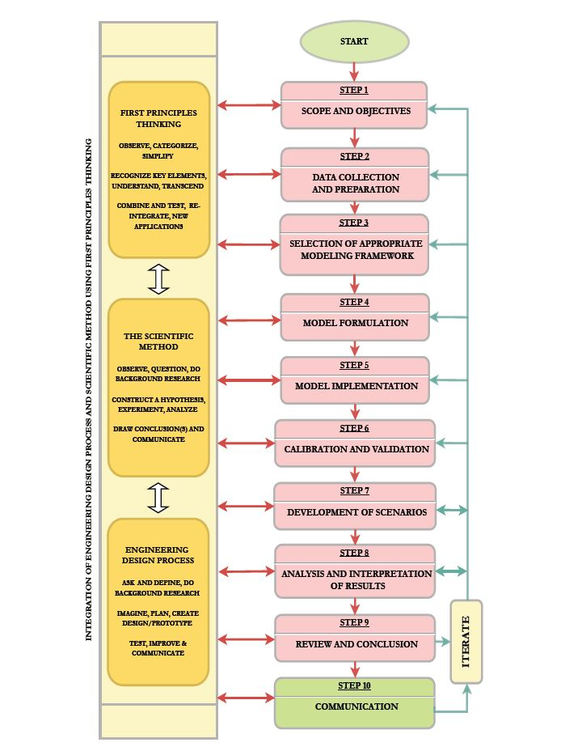
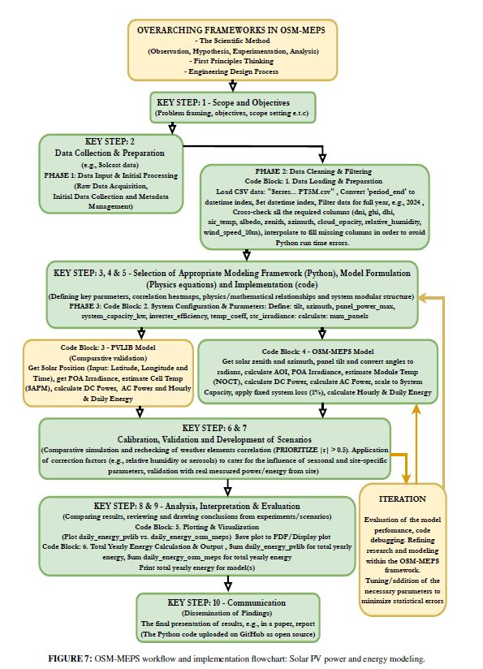

## ⚠️ Error during latex code prompting

## Derivation (Dot Product)

The Angle of Incidence (AOI) is derived from the **dot product** between the solar vector and the panel normal vector:

`cos(θ_AOI) = cos(θ_z)·cos(θ_t) + sin(θ_z)·sin(θ_t)·cos(φ_s − φ_p)`

In our code, we used the correct formula, as can be seen by the files uploaded. However, we mistyped two instances of the equation in our journal paper (+ ought to be · i.e. `sin(θ_z)·sin(θ_t) + cos(φ_s − φ_p) -> sin(θ_z)·sin(θ_t)·cos(φ_s − φ_p))`. We therefore disclose this to readers and modelers in general.

❌ **Incorrect form:**  
`θ_AOI = cos⁻¹[ cos(θ_z)·cos(θ_t) + sin(θ_z)·sin(θ_t) + cos(φ_s − φ_p) ]`

✅ **Correct form:**  
`θ_AOI = cos⁻¹[ cos(θ_z)·cos(θ_t) + sin(θ_z)·sin(θ_t)·cos(φ_s − φ_p) ]`

# OSM-MEPS: Solar PV

This repository contains code, data and documentation for the systematic open source modeling method for energy and power system modeling focused on solar photovoltaic (PV) generation. 
It supports analysis, simulation and visualization of energy yield for validation using open-source tools such as Python and PVLIB and site measured data from https://pvoutput.org/list.jsp?df=20241201&dt=20241231&id=84471&sid=77748&t=m&v=0.

## Overview

The project includes:
- **OSM-MEPS** (Open Source Modeling Method for Energy and Power Systems) model, derived from key steps in energy and power systems modeling and its overarching frameworks that combines first-principles thinking, the scientific method and engineering design.
- High-resolution solar PV simulations using meteorological inputs such as GHI, DNI, temperature and relative humidity.
- Comparative analysis with PVLIB model and real world solar PV energy data across multiple sites (e.g., Greece, South Africa, Australia and Kenya).
- Energy yield estimation, angle of incidence modeling and tilt-azimuth optimization.

## Requirements

- Python 3.8+
- [PVLIB](https://pvlib-python.readthedocs.io/)
- NumPy, Pandas, Matplotlib, SciPy
- Jupyter Notebook (optional for interactive exploration)

## OSM-MEPS (Open Source Modeling Method for Energy and Power Systems)

[OSM-MEPS Method Overview]

  
   
  <em>Figure 1: Overview of the OSM-MEPS with its overarching frameworks.</em>

## OSM-MEPS Workflow

Below is the workflow illustrating how the model integrates data, processes, and simulations from input to output.

[OSM-MEPS Workflow]

  
   
  <em>Figure 2: Workflow of the OSM-MEPS model from solar PV modeling.</em>

## Citing OSM-MEPS method and model

Please cite our work as follows:

P. M. Mutuku, A. L. L. Jarvis, A. G. Swanson and M. F. Khan,  "A Systematic Open Source Modeling Method for Energy and Power Systems: Solar PV Application,"  *IEEE Access*, vol. 13, pp. 131869–131908, 2025,  doi: [10.1109/ACCESS.2025.3592577 (https://doi.org/10.1109/ACCESS.2025.3592577)

## Contact

If you have any questions, suggestions, or would like to collaborate, feel free to connect with me on [LinkedIn](https://www.linkedin.com/in/peter-munyao-3251b3a4/).
